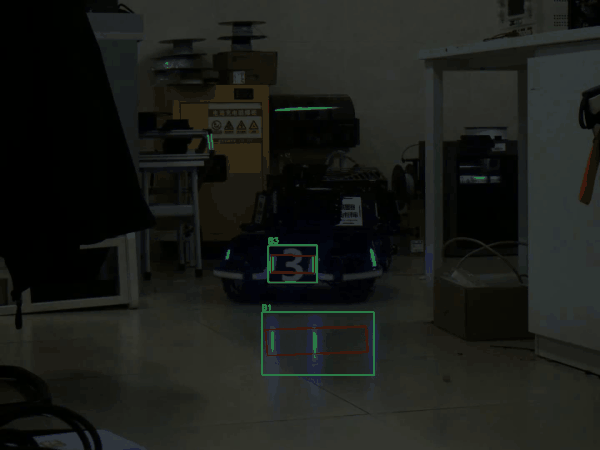
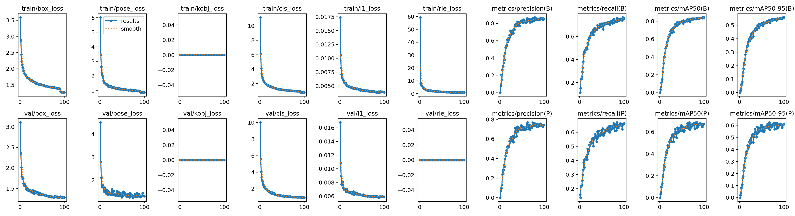
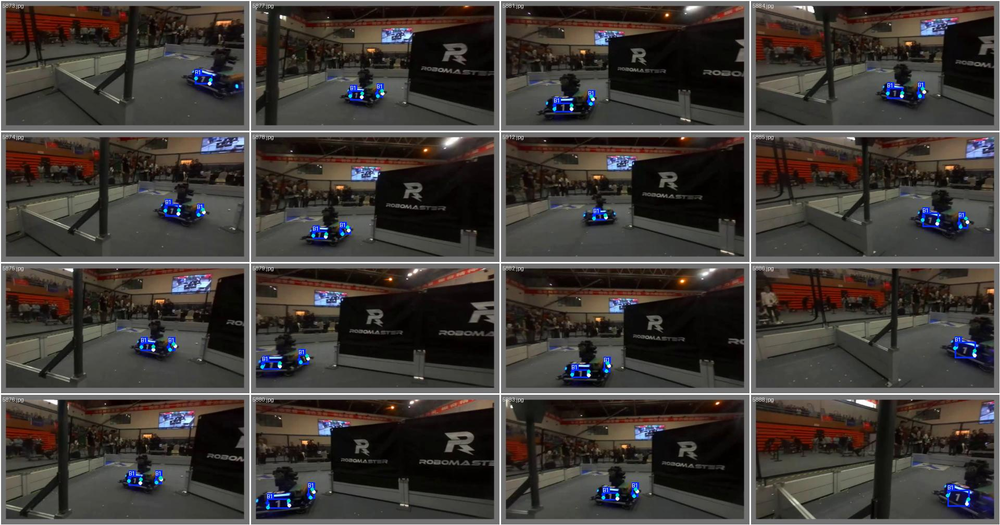
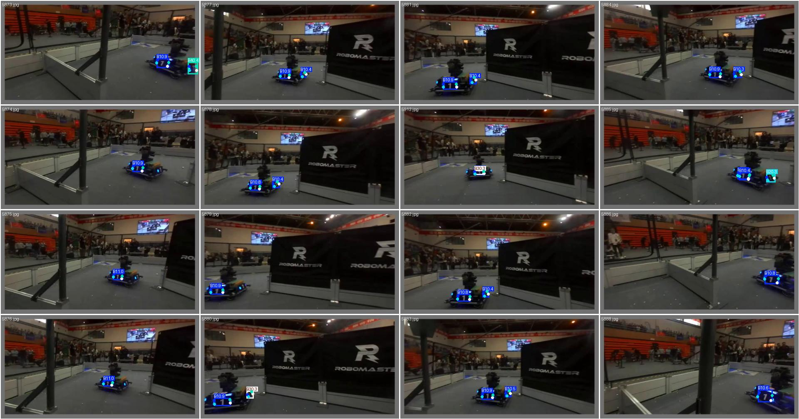

# RM 装甲板视觉：从 YOLO 训练到 C++ / ROS2 部署

> 从零训练 YOLO26-pose 装甲板关键点模型 → 导出 ONNX → 用 **C++ + onnxruntime 实现完整推理管线**（预处理 / 解码 / NMS / 坐标还原）→ 接入 **ROS2** 发布带框图像话题。



*上图：低照度环境下的检测结果。**绿框**为检测框（左上角为类别名），**红色折线**为模型预测的 4 个角点依次连接而成的四边形。完整视频见 [`docs/demo.mp4`](docs/demo.mp4)。*

## 内容导航

| 关注点 | 位置 |
|---|---|
| 训练数据、超参数、逐 epoch 指标 | [`01-yolo-training/`](01-yolo-training/) |
| 推理代码实现（letterbox、8400 候选解码、IoU、NMS） | [`02-onnx-inference/`](02-onnx-inference/) |
| ROS2 节点与 `cv_bridge` 图像发布 | [`03-ros2-integration/`](03-ros2-integration/) |
| 三篇配套博客（含踩坑过程） | [`docs/`](docs/) |

---

## 效果与数据

| 项目 | 结果 |
|---|---|
| 训练数据 | XJTLU 2023 Keypoints（6732 张：**train 4224 / val 2508**；14 类；4 角点） |
| 训练方式 | **从随机初始化开始训练**（100 epoch，约 68 分钟，见 [`01-yolo-training/README.md`](01-yolo-training/README.md#6-训练方式本次为从随机初始化开始)） |
| **检测框** | Precision 0.850 / Recall 0.760 / **mAP50 0.842** / **mAP50-95 0.559** |
| **关键点（角点）** | Precision 0.744 / Recall 0.662 / **mAP50 0.675** / **mAP50-95 0.610** |
| 部署形态 | C++ + onnxruntime，letterbox 预处理 / 8400 候选解码 / IoU / NMS / 坐标还原均为自行实现 |
| ROS2 集成 | 节点发布 `sensor_msgs::msg::Image`（带框）→ RViz2 可视化 |
| 性能实测 | 纯转发约 **20Hz**；接入 CPU 推理后降至 **几 Hz** |

### 训练曲线



### 验证集效果对比（左：标注真值 / 右：模型预测）

| 真值 | 预测 |
|---|---|
|  |  |

**逐类指标中的异常**：`R5` 的检测 mAP50 为 0.897，但角点 mAP50 仅 0.329。
检测与关键点共享同一套特征，检测正常而关键点显著偏低，指向该类样本的**关键点标注质量问题**，而非模型容量不足。
完整逐类表见 [`01-yolo-training/README.md`](01-yolo-training/README.md#52-逐类结果)。

---

## 目录结构

```
.
├── 01-yolo-training/      训练：数据配置、训练命令、100 epoch 全部产物与指标
│   ├── dataset.yaml       数据集配置（14 类 / 4 关键点）
│   ├── train.sh           训练命令
│   ├── export_onnx.sh     导出 ONNX
│   └── results/           训练曲线、PR 曲线、混淆矩阵、args.yaml、results.csv
├── 02-onnx-inference/     C++ 推理：预处理 → 解码 → NMS → 画框 → 视频输出
├── 03-ros2-integration/   ROS2 节点：发布带框图像话题 + CMake 配置
└── docs/                  三篇配套博客全文存档
```

---

## 环境

- **操作系统**：Ubuntu 22.04
- **推理侧**：OpenCV 4.5.4，onnxruntime 1.23.2（CPU）
- **机器人侧**：ROS2 Humble
- **训练侧**：Python 3.10.12 + ultralytics 8.4.142 + PyTorch，RTX 4060 Laptop（8G）

---

## 快速开始

### 0. 准备模型

将训练导出的 `best.onnx` 放入 `02-onnx-inference/weights/`。

> `.onnx` / `.pt` 因体积原因未入库。可按 [`01-yolo-training/train.sh`](01-yolo-training/train.sh) 重新训练，再用 [`export_onnx.sh`](01-yolo-training/export_onnx.sh) 导出。

### 1. C++ 单机推理（处理视频）

```bash
cd 02-onnx-inference
g++ -std=c++17 draw_refactored.cpp -o draw_refactored \
    -I /path/to/onnxruntime_include \
    -L /path/to/onnxruntime/lib -l:libonnxruntime.so.1.23.2 \
    -Wl,-rpath,/path/to/onnxruntime/lib \
    $(pkg-config --cflags --libs opencv4)

./draw_refactored weights/best.onnx test.mp4     # 输出 out.mp4
```

### 2. ROS2 集成

```bash
# 将 armor_pkg 放入 ROS2 workspace，并按 03 的说明修改 CMakeLists 中的路径
cd ~/ros2_ws
colcon build --packages-select armor_pkg
source /opt/ros/humble/setup.bash && source install/setup.bash

ros2 run armor_pkg armor_yolo_node
ros2 topic hz /armor_image      # 查看发布频率
rviz2                           # Add → By topic → /armor_image → Image
```

---

## 已知问题与排查

| 现象 | 原因 | 处理 |
|---|---|---|
| `libonnxruntime.so.1: cannot open shared object file` | 运行期搜索路径（rpath）缺失；且 onnxruntime 的 SONAME 为 `libonnxruntime.so.1`（"小名"），与链接时使用的带版本号文件名不一致（**编译期能找到 ≠ 运行期能找到**） | 补建软链；CMake 设置 `INSTALL_RPATH`；或临时设置 `LD_LIBRARY_PATH` |
| 检测结果整体偏移 / 精度异常 | 推理侧预处理与训练侧不一致 | 逐项核对：灰边填充值 114、BGR→RGB、÷255、HWC→CHW |
| 帧率只有几 Hz | CPU 推理为瓶颈 | 在采集、处理、发布三段分别加计时探针定位，再针对性优化：降输入尺寸 / 跳帧 / 量化 FP16·INT8 / GPU(TensorRT) / 多线程解耦 |

详见 [`03-ros2-integration/README.md`](03-ros2-integration/README.md#5-遇到的问题与排查) 与 [`docs/`](docs/)。

---

## 相关链接

### 配套博客（CSDN，对应本仓库三个环节）

| 环节 | 文章 | 数据 |
|---|---|---|
| ① C++ 推理全流程 | [从 8400 张卡片到画框：用 C++ 跑通 YOLO 姿态模型](https://blog.csdn.net/2604_96052374/article/details/164992742) | 395 阅读 · 6 赞 |
| ② 训练 | [训练一个关键点模型（You Only Look Once）YOLO](https://blog.csdn.net/2604_96052374/article/details/165122893) | 330 阅读 · 3 赞 |
| ③ ROS2 集成 | [YOLO 装甲板检测接入 ROS2](https://blog.csdn.net/2604_96052374/article/details/165356050) | 280 阅读 · 3 赞 |

三篇文章的全文同时存放在本仓库 [`docs/`](docs/) 中。

### 其它

- 传统视觉装甲板检测项目：`RM_project`（HSV 阈值 + 灯条几何配对 + 串口通信）
- 作者主页：<https://blog.csdn.net/2604_96052374>

---

## 说明

本项目用于个人学习与 RoboMaster 战队考核。
数据集 **XJTLU 2023 Keypoints** 为公开数据集，引用请注明来源。
